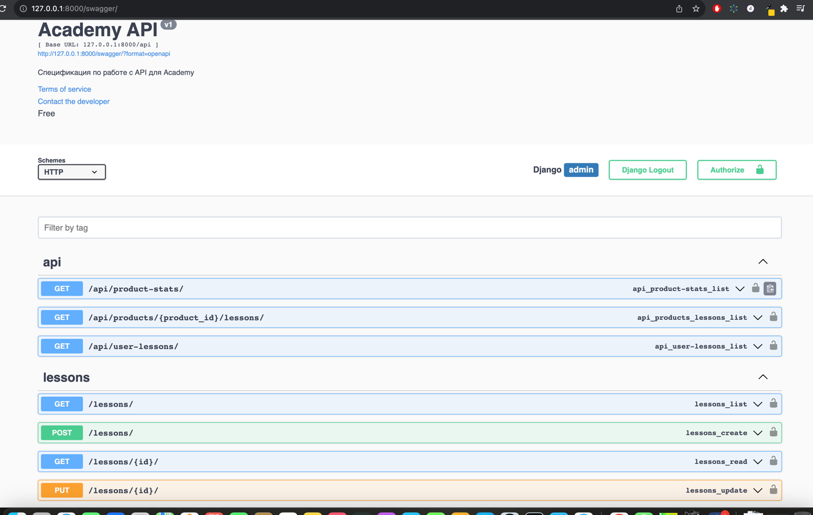
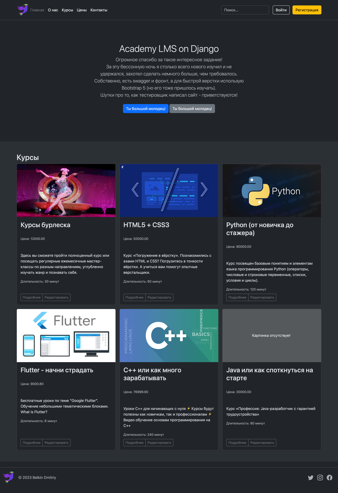

# LMS on Django

## Релизовано:
- **Построение архитектуры**
- - Создать сущность продукта. У продукта должен быть владелец. Необходимо добавить сущность для сохранения доступов к продукту для пользователя.
- - Создать сущность урока. Урок может находиться в нескольких продуктах одновременно. В уроке должна быть базовая информация: название, ссылка на видео, длительность просмотра (в секундах).
- - Урок могут просматривать множество пользователей. Необходимо для каждого фиксировать время просмотра и фиксировать статус “Просмотрено”/”Не просмотрено”. Статус “Просмотрено” проставляется, если пользователь просмотрел 80% ролика.

- **Написание запросов**
- - Реализовать API для выведения списка всех уроков по всем продуктам к которым пользователь имеет доступ, с выведением информации о статусе и времени просмотра.
- - Реализовать API с выведением списка уроков по конкретному продукту к которому пользователь имеет доступ, с выведением информации о статусе и времени просмотра, а также датой последнего просмотра ролика.
- - Реализовать API для отображения статистики по продуктам. Необходимо отобразить список всех продуктов на платформе, к каждому продукту приложить информацию:
- - - Количество просмотренных уроков от всех учеников.
- - - Сколько в сумме все ученики потратили времени на просмотр роликов.
- - - Количество учеников занимающихся на продукте.
- - - Процент приобретения продукта (рассчитывается исходя из количества полученных доступов к продукту деленное на общее количество пользователей на платформе).

- **Дополнительно**
- - Swagger

- - Главная страница

## Инструкция
### 1. Клонировать проект:
`clone https://github.com/dmitriy-belkin/lms-django.git`

### 2. Установка модулей:
`pip install -r requirements.txt`

### 3. Перейти в директорию lms:
`cd lms`

### 4. Запустить сервер:
`python manage.py runserver`

## Дополнительно
- Для доступа к swagger 
`host/swagger/`
- Для доступа в админку
`host/admin/academy/userlesson/`
- Креды администратора: admin 12345
- Креды пользователя: student Qwerty123!
- Главная страница сайта
`host`

## Road Map
- ~~Выполнить условия задания (!important)~~
- ~~Прикрутить swagger~~
- ~~Сделать index страницу~~
- - ~~Вывод доступных курсов~~
- - ~~Кнопка редактировать курса отображается только для staff~~
- - ~~Авторизация~~
- - Регистрация
- - ~~Настроить страницу курсов (отображение уроков)~~
- - Доработать дизайн для страницы курсов по стилистике
- - Добавить video player
- - Система аттестации
- - Переход на MySQL или PostgreSQL